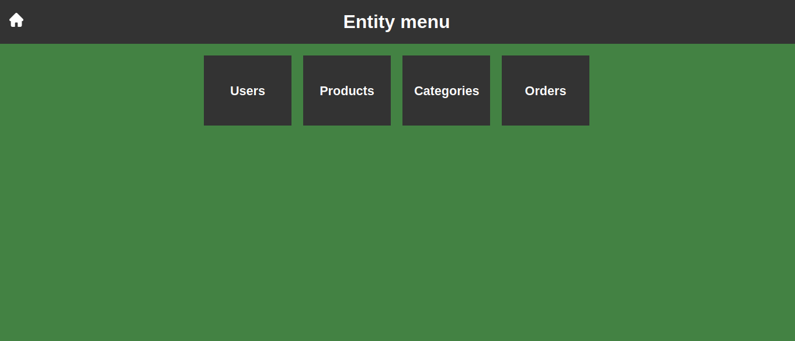
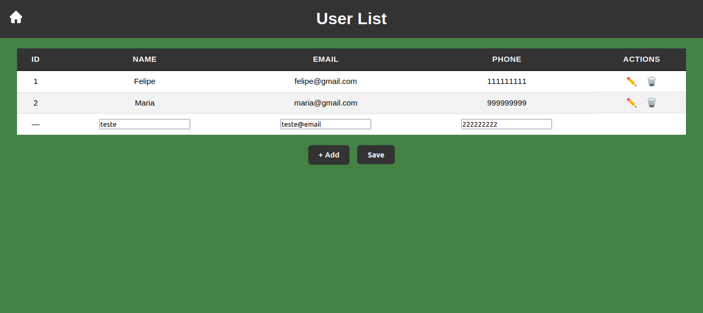
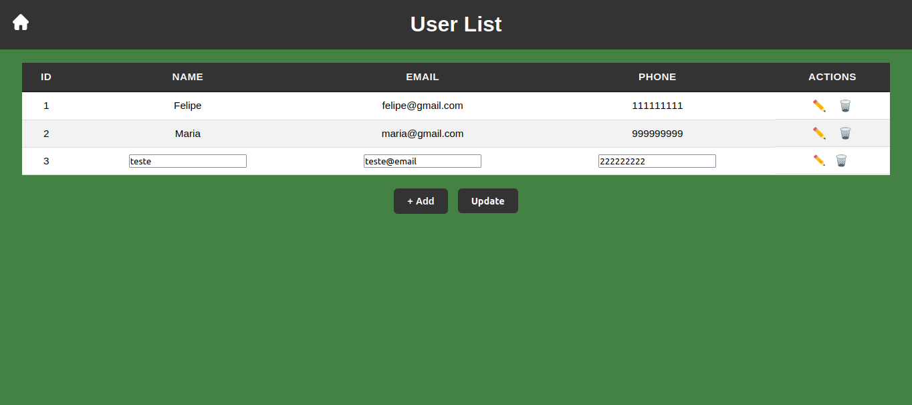
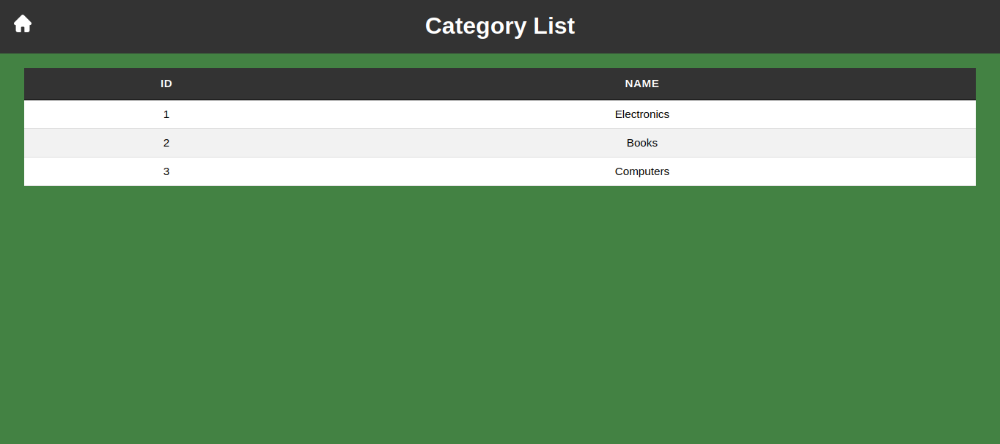
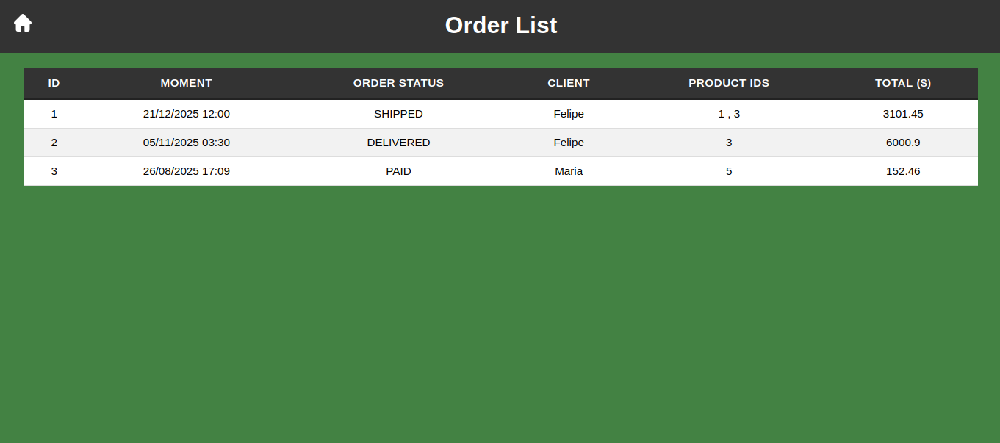

# Spring Boot Order System

Aplicação desenvolvida em **Java com Spring Boot**, com foco em **aprendizado prático**, arquitetura em camadas e integração entre **API REST** e **aplicação Web (MVC)**.

O projeto foi desenvolvido **inicialmente a partir do curso online**  
**Java COMPLETO: Programação Orientada a Objetos + Projetos**, do professor **Nelio Alves (Udemy)** — atualmente com **77% de progresso**, em fase final para obtenção do certificado.

A partir da base ensinada no curso, o projeto foi **expandido por iniciativa própria**, incluindo uma interface web com **Thymeleaf** para complementar as operações de CRUD realizadas via API.

---

## 🔗 Deploy da Aplicação

👉 **Link da aplicação no Render:**  
**[https://workshop-springboot4-jpa.onrender.com](https://workshop-springboot4-jpa.onrender.com)**

> Obs: o banco PostgreSQL foi provisionado no Render para fins de estudo e configuração de ambiente.

---

## 🎯 Objetivo do Projeto

- Consolidar conceitos de **Spring Boot**
- Aplicar **arquitetura em camadas**
- Implementar **CRUD completo**
- Integrar **backend REST** com **frontend MVC**
- Trabalhar com **tratamento de exceções**
- Simular uma aplicação real para fins de aprendizado prático

---

## 🧱 Arquitetura da Aplicação

A aplicação segue uma **arquitetura em camadas bem definida**, conforme boas práticas ensinadas no curso:

### 🔹 Resource Layer (REST Controllers)
- Endpoints REST da aplicação
- Comunicação via HTTP (JSON)
- Testes realizados com Postman

### 🔹 Service Layer
- Regras de negócio
- Validações
- Tratamento de exceções

### 🔹 Data Access Layer (Repositories)
- Persistência de dados
- Spring Data JPA
- Hibernate

### 🔹 Controller Layer (MVC)
- Renderização de páginas HTML
- Integração com Thymeleaf
- Operações de CRUD via interface web

> Inicialmente, as operações de CRUD eram realizadas apenas via **Postman**, conforme proposto no curso.  
> A camada MVC foi adicionada posteriormente como **extensão do aprendizado**.

---

## 🧩 Funcionalidades Implementadas

- ✅ CRUD completo da entidade **User**
- 📄 Listagem de usuários
- ➕ Criação de usuários
- ✏️ Edição de usuários
- 🗑️ Exclusão com modal de confirmação
- ⚠️ Tratamento de exceções (integridade referencial)
- 💬 Mensagens de erro amigáveis
- 📄 Listagem de outras entidades como produto, categoria e pedido 
- 🏠 Navegação entre páginas

---

## 🛠️ Tecnologias Utilizadas

### Backend
- Java 21
- Spring Boot
- Spring MVC
- Spring Data JPA
- Hibernate
- Tomcat (embutido)
- Maven

### Banco de Dados
- H2 (ambiente de desenvolvimento)
- PostgreSQL (provisionado no Render)

### Frontend
- HTML5
- CSS3
- JavaScript (Vanilla)
- Thymeleaf

### Ferramentas
- Postman
- Render (deploy)

---

## 📦 Principais Dependências

- Spring Boot Starter Web MVC
- Spring Boot Starter Data JPA
- Spring Boot Starter Thymeleaf
- H2 Database
- PostgreSQL Driver
- Spring Boot Test

---

## 📸 Demonstração da Aplicação

### 🔹 Diagrama de Entidades
> Material disponibilizado no curso

📷 ****

---

### 🔹 Interface Web – Menu das Entidades

📷 ****

---

### 🔹 Interface Web – Listagem de Usuários

📷 ****

---

### 🔹 Interface Web – Formulário de Criação

📷 ****

---

### 🔹 Interface Web – Formulário de Edição

📷 ****

---

### 🔹 Interface Web – Formulário de Exclusão

📷 ****

---

### 🔹 Interface Web – Formulário de Exclusão com Exceção

📷 ****

---

### 🔹 Interface Web – Listagem de Produtos

📷 ****

---

### 🔹 Interface Web – Listagem de Categorias

📷 ****

---

### 🔹 Interface Web – Listagem de Pedidos

📷 ****

---

## 🚀 Como Executar o Projeto Localmente

```bash
git clone https://github.com/seu-usuario/springboot-order-system.git
cd springboot-order-system
./mvnw spring-boot:run
